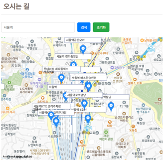

# 프로젝트명 (호텔 사이트 API 연동)

## 📝 소개

기존 사이트에 필요한 API를 연동시킨 프로젝트

기간 : 25.01.03 ~ 25.01.14

개발인원 : 4명
👉 [프로젝트 소개 PPT](https://drive.google.com/drive/folders/1DBtAOxNeNGIUqoTV0znT3dxLUAShyKPv?usp=drive_link)

  
🛠 기술 스택

  <ul>
    <li><strong>Frontend</strong>: React, SCSS, JavaScript</li>
    <li><strong>Database</strong>: MariaDB</li>
    <li><strong>공개 API</strong>:
      <ul>
        <li><strong>이경근</strong>: Toss 결제 API</li>
        <li><strong>우수정</strong>: 네이버 로그인 API</li>
        <li><strong>김수훈</strong>: Google 캘린더 API, Kakao map API, 기상청 날씨 API</li>
        <li><strong>한수연</strong>: Coolsms 본인인증 API, TinyMCE 스마트에디터 API</li>
      </ul>
    </li>
  </ul>

  
시연화면

  <ul>
    <li>
결제
</li>
    
  </ul>
  <ul>
    <li>
로그인
</li>
    
  </ul>
  <ul>
    <li>
구글 캘린더
</li>
    
  </ul>
  <ul>
    <li>
카카오맵
</li>
    
  </ul>
  <ul>
    <li>
날씨
</li>
    
  </ul>
  <ul>
    <li>
본인인증
</li>
    
  </ul>
  <ul>
    <li>
스마트 에디터
</li>
    
  </ul>

